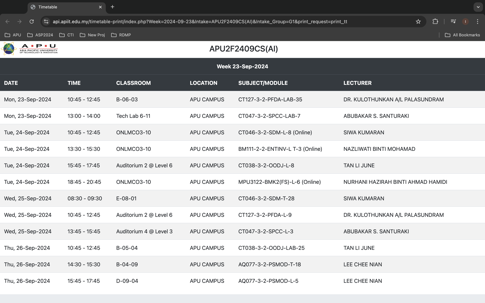
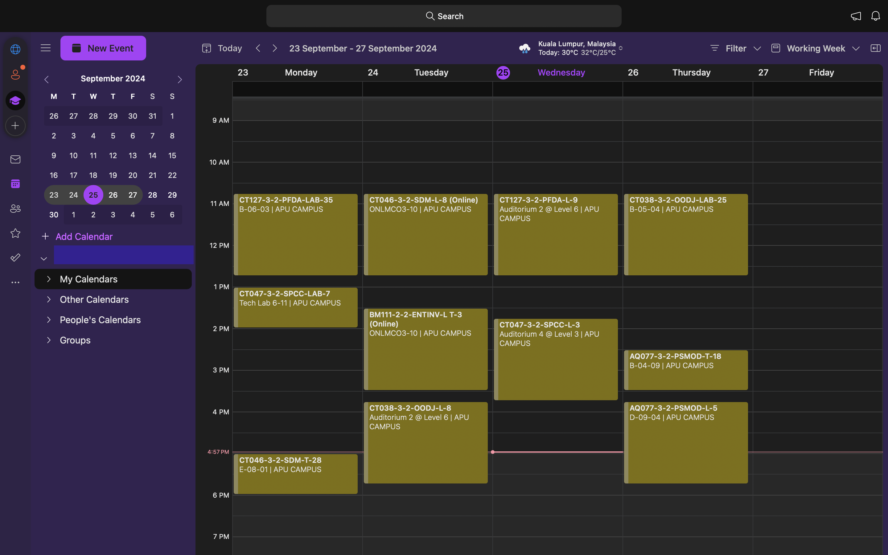
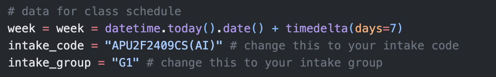
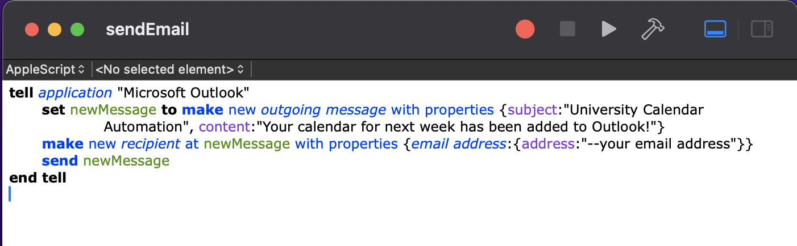
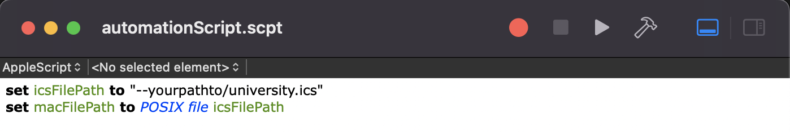
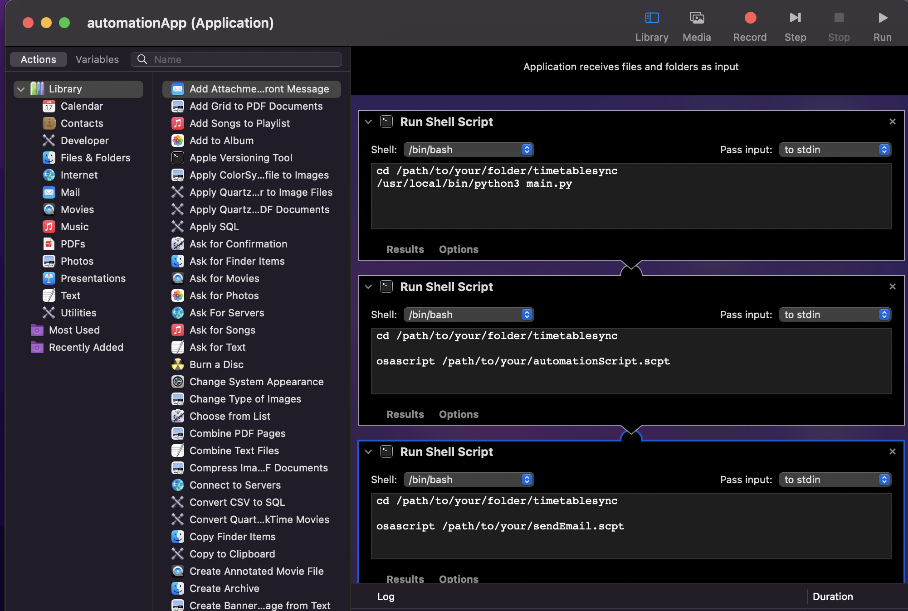
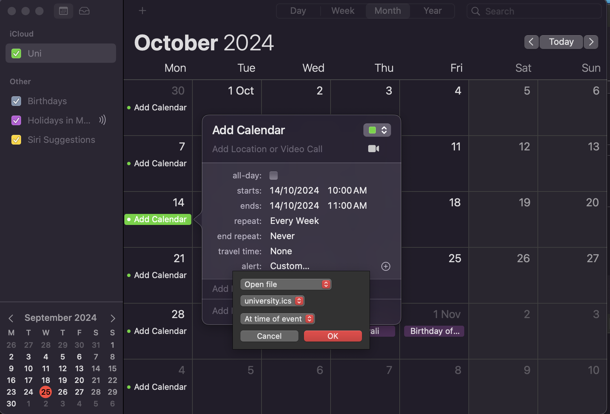

<h1 align="center">Welcome to TimtableSync 👋</h1>
<p>
  <a href="https://github.com/IsabelleFong/timetablesync#readme" target="_blank">
    
  </a>
  <a href="https://github.com/IsabelleFong/timetablesync/master/LICENSE" target="_blank">
    
  </a>
</p>

> macOs application that syncs your APSpace timetable to Microsoft Outlook

## 🎯 Objective
TimetableSync is used to automate the process of adding weekly timetables from APSpace Website (Asia Pacific University Application) to Microsoft Outlook and Microsoft Teams on macOS.

## ⚙️ How it Works

1. A weekly recurring event is set on the local Calendar application. During the time of the event, the Calendar will trigger the launch of the ``automationApp.app``. 
2. ``automationApp.app`` runs ``main.py`` which will scrape the timetable data from APSpace website and convert the raw data into an iCalendar file (ICS).
3. ``automationApp.app`` will then continue to run ``automationScript.scpt`` to import the iCalendar file (ICS) generated to the Microsoft Outlook Desktop application.
4. Once the iCalendar file has been added ``automationApp.app`` will run ``sendEmail.scpt`` to send you an email indicating that the weekly calendar has been added successfully to your Microsoft Outlook Calendar.
5. The new calendar will appear on both your Microsoft Outlook Calendar and Microsoft Teams Calendar.

#### APSpace Timetable



#### Microsoft Outlook Calendar



## Prerequisites
1. macOs
2. ``python v3`` and above
3. ``pip``
4. Visual Studio Code / PyCharm / etc
5. Microsoft Outlook Desktop App


## Install
Run the following code in your terminal:
```sh
git clone https://github.com/IsabelleFong/timetablesync.git
```
Open the timetablesync folder in your chosen IDE and run the following code in the terminal to install the required libraries:
```sh
pip install -r requirements.txt
```

## Usage
1. Open ``main.py`` and replace the intake code and intake group to your own intake code and group respectively





2. Open ``sendEmail.scpt`` and add your email address (the email address that receives the update notice)





3. Open ``automationScript.scpt`` and replace the calendar path with your actual timetable sync folder path



 
4. Launch the Automator application and choose file type: Application. Click open an existing document and select ``automationApp.app``. Replace the ``/path/to/your/..`` with your actual paths





5. Launch the Calendar app and create a new event on Monday with your preferred start time. Set ``repeat: Every Week`` and ``alert: Custom...``. Select ``Open file``, ``university.ics``, and ``At time of event ``.





6. Set Microsoft Outlook as your default calendar


## Languages, Libraries and Applications Used
1. Python (Libraries: ``requests``, ``Beautiful Soup``, ``ics``, ``pytz``, ``datetime``)
2. Script Editor (``AppleScript``)
3. Automator (``bash``)
4. Calendar
5. Microsoft Outlook Desktop App


## Author

👤 **Isabelle Fong**

* Github: [@IsabelleFong](https://github.com/IsabelleFong)
* LinkedIn: [@IsabelleFong](https://linkedin.com/in/IsabelleFong)

## Show your support

Give a ⭐️ if this project helped you!

## 📝 License

Copyright © 2024 [Isabelle Fong](https://github.com/IsabelleFong).<br />
This project is [MIT](https://github.com/IsabelleFong/timetablesync/master/LICENSE) licensed.

***
_This README was generated with ❤️ by [readme-md-generator](https://github.com/kefranabg/readme-md-generator)_
